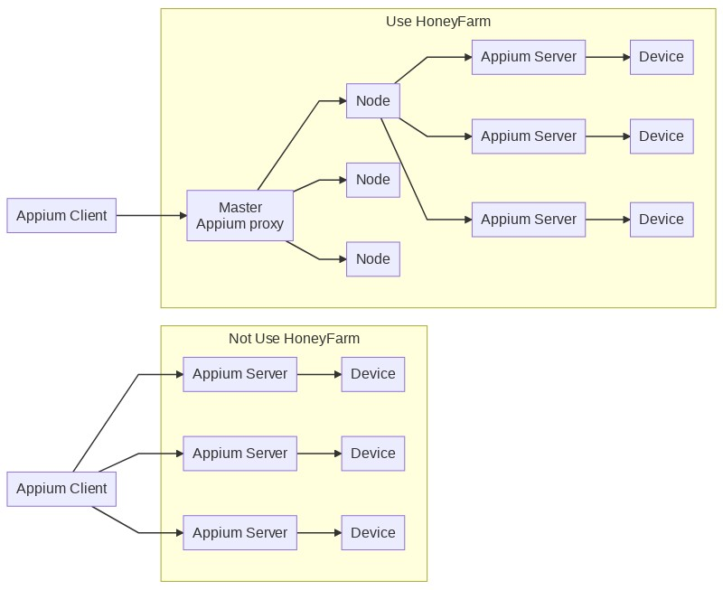
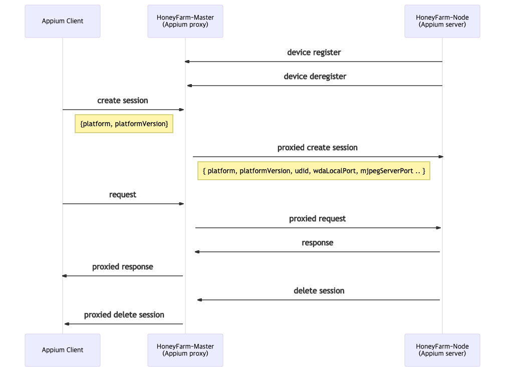

# HoneyFarm

## Table of Contents

1. [HoneyFarm이란](#HoneyFarm이란)
2. [HoneyFarm의 장점](#HoneyFarm의-장점)
3. [Quick Start](#quick-start)
	- [HoneyFarm-Master](#HoneyFarm-Master)
	- [HoneyFarm-Node](#HoneyFarm-Node)

## HoneyFarm이란
HoneyFarm은 분산 되어있는 Appium 서버들을 별도의 설정 없이 통합 관리하는 proxy 서버입니다.



## HoneyFarm의 장점
1. 분산된 Appium 서버를 통합 관리합니다. HoneyFarm-Master가 HoneyFarm-Node를 통해 Appium 서버들을 관리하기 때문에 사용자 입장에서 HoneyFarm-Master와 통신만 하면 각각의 Appium 서버를 정확한 EndPoint를 모르더라도 사용 가능합니다.
2. 다중 테스트를 진행하는데 간편한 설정으로 진행이 가능합니다. [Appium Parallel Tests](http://appium.io/docs/en/advanced-concepts/parallel-tests/)를 참고 다중 테스트를 하기 위해서는 udid, mjpegServerPort, wdaLocalPort 등을 각각 설정해줘야 하지만 HoneyFarm-Master을 사용하면 platform과 plartformVersion만 설정하면 HoneyFarm-Master에서 자동으로 필요한 옵션을 할당합니다. 
	- udid를 지정하면 특정 단말을 선택할 수도 있습니다.
3. Appium에서 지원하지 않는 `plartformVersion: *`를 지원합니다. `*`로 보낼 경우 HoneyFarm-Master에서 자동으로 사용가능 자원을 선택 합니다.
4. 직접 실기기 및 에뮬레이터, 시뮬레이터를 사용하기 때문에 다른 테스팅 플랫폼과 다르게 단말의 모든 기능을 사용할 수 있습니다.
	- 다른 플랫폼의 경우 보안상의 이유로 모든 기능을 사용할수 없습니다.




## Quick Start
### HoneyFarm-Master 
```sh
$ npm install -g @zigbang/honeyfarm-master
$ honeyfarm-master
```
or
```sh
$ npx @zigbang/honeyfarm-master honeyfarm-master
```
자세한 내용 [HoneyFarm-Master README](./packages/master/README.md)를 참고하시기 바랍니다.

### HoneyFarm-Node 

[Appium 설치](http://appium.io/docs/en/about-appium/getting-started/#installing-appium)를 참고해 Appium 설치 및 환경 설정을 진행합니다.

[Appium-Doctor](http://appium.io/docs/en/about-appium/getting-started/#verifying-the-installation)를 참고해 Appium Doctor를 설치하고 Appium 설정이 제대로 되었는지 확인 할 수 있습니다.

```sh
$ npm install -g @zigbang/honeyfarm-node
$ npx honeyfarm-node
```
or
```sh
$ npx @zigbang/honeyfarm-node honeyfarm-node
```
자세한 내용 [HoneyFarm-Node README](./packages/node/README.md)를 참고하시기 바랍니다.
