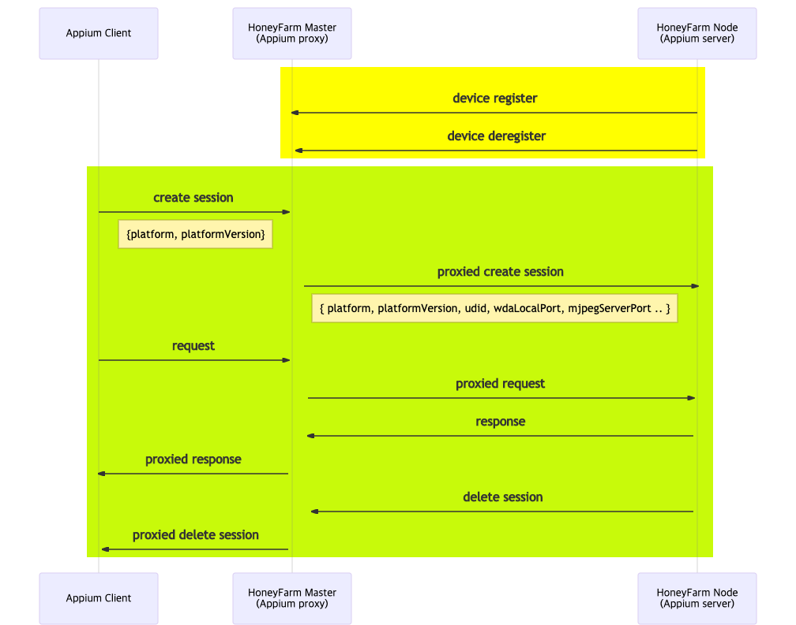

# HoneyFarm
HoneyFarm은 분산 되어있는 Appium 서버들을 별도의 설정 없이 통합 관리하는 서버 프로그램입니다.

HoneyFarm을 미 사용시 각각의 Appium Server와 단말을 지정해줘야 테스트를 진행할 수 있습니다. 


HoneyFarm을 사용시 HoneyFarm Mater가 HoneyFarm Node를 통해 Appium Server를 통합 관리하기 때문에 Appium Client는 HoneyFarm Mater과 통신만 하면 테스트를 진행할 수 있습니다.


## 장점
### 분산된 Appium 서버를 통합 관리
HoneyFarm Master가 HoneyFarm Node를 통해 Appium 서버들을 관리하기 때문에 사용자 입장에서 HoneyFarm Master와 통신만 하면 각각의 Appium 서버를 정확한 EndPoint를 모르더라도 사용 가능합니다.

### 다중 테스트를 진행하는데 간편한 설정으로 진행 가능
[Appium Parallel Tests](http://appium.io/docs/en/advanced-concepts/parallel-tests/)를 보면 다중 테스트를 하기 위해서는 udid, mjpegServerPort, wdaLocalPort 등을 각각 설정해 줘야 합니다. HoneyFarm Master을 사용하면 platform과 plartformVersion만 설정하면 HoneyFarm Master가 자동으로 필요한 옵션을 할당합니다.

### `plartformVersion: *` 지원
`plartformVersion: *`로 보낼 경우 HoneyFarm Master에서 자동으로 plartformVersion과 무관한 하나의 단말을 반환합니다.

### 단말의 모든 기능을 사용
다른 플랫폼의 경우 보안상의 이유로 모든 기능을 사용할수 없는 경우가 있지만 직접 실기기 및 에뮬레이터, 시뮬레이터를 사용하기 때문에 모든 기능을 사용 가능합니다.


## HoneyFarm의 동작 방식



## Install and Run
### HoneyFarm Master 
허나팜 마스터를 실행하기 위해서는 다음과 같은 명령어를 실행하면 됩니다.
```sh
$ npm install -g @zigbang/honeyfarm-master
$ honeyfarm-master
```
or
```sh
$ npx @zigbang/honeyfarm-master honeyfarm-master
```

### HoneyFarm Node 
하니팜노드를 사용하기 위해서는 Appium을 설치해야 합니다.
[Appium 설치](http://appium.io/docs/en/about-appium/getting-started/#installing-appium) 및 환경 설정을 진행하고 [Appium Doctor](http://appium.io/docs/en/about-appium/getting-started/#verifying-the-installation)를 이용하여 Appium 설정이 제대로 되었는지 확인 할 수 있습니다.

허나팜 노드를 실행하기 위해서는 다음과 같은 명령어를 실행하면 됩니다.
```sh
$ npm install -g @zigbang/honeyfarm-node
$ npx honeyfarm-node
```
or
```sh
$ npx @zigbang/honeyfarm-node honeyfarm-node
```
